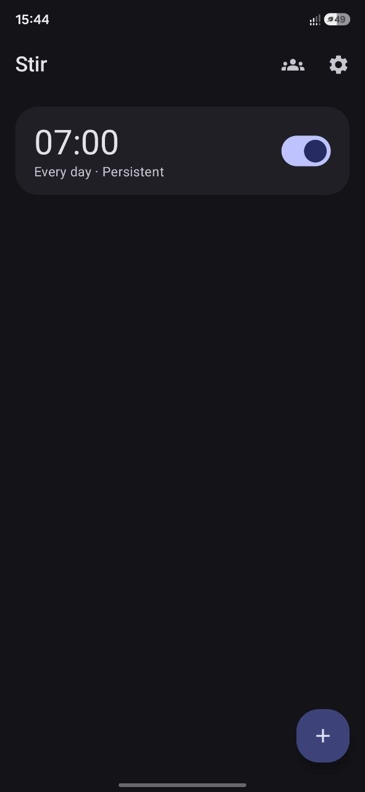
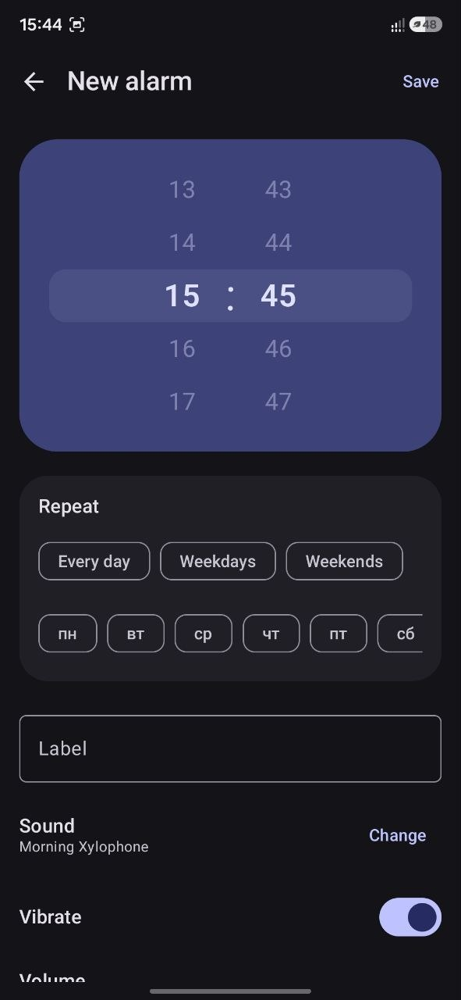

# Stir

A calm Android alarm clock.

## Screenshots

<table>
  <tr>
    <td></td>
    <td></td>
  </tr>
  <tr>
    <td align="center">Alarm list</td>
    <td align="center">New alarm, wheel time picker and repeat presets</td>
  </tr>
</table>

## Building

```
./gradlew assembleDebug
```

The debug APK lands in `app/build/outputs/apk/debug/`.

### Release builds and signing

Release builds are unsigned by default. To sign locally, create a `keystore.properties` file at
the repo root (gitignored, never commit it):

```properties
storeFile=/absolute/path/to/release.keystore
storePassword=...
keyAlias=...
keyPassword=...
```

Then run `./gradlew assembleRelease`. Without this file, `assembleRelease` still succeeds and
produces an unsigned APK.

### CI release workflow

`.github/workflows/release.yml` builds a release APK and AAB on every `vX.Y.Z` tag push (or
manual dispatch) and attaches them to a GitHub Release. To have it produce a signed build, add
these repository secrets:

- `KEYSTORE_BASE64`: your keystore file, base64-encoded (`base64 -w0 release.keystore`)
- `KEYSTORE_PASSWORD`, `KEY_ALIAS`, `KEY_PASSWORD`

Without those secrets the workflow still runs and publishes an unsigned build.

## Known tradeoffs

- Only one alarm rings at a time; if a second alarm (typically a group sibling) fires while one
  is already ringing, it queues behind the current session instead of ringing concurrently.
- Aggressive OEM battery managers (MIUI, EMUI, etc.) are known to kill background work regardless
  of correct AOSP-level foreground service usage; this is outside what an app can fully control.
- `USE_EXACT_ALARM` auto-grant depends on the OS recognizing Stir as an alarm-clock-category app;
  `SCHEDULE_EXACT_ALARM` with a Settings redirect is the fallback when it isn't.

## License

GNU General Public License v3.0.
